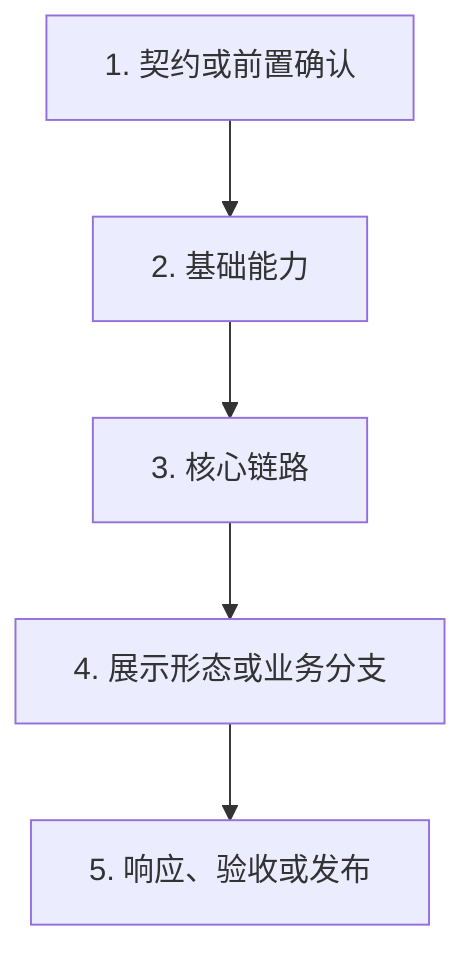

# 分阶段技术实现文档模板

同一份文档先生成计划态，再在每一步真实完成后就地追加完全态内容。初稿严格停在每步的“加什么功能”。

## 计划态：初次生成

````markdown
# <YYYYMMDD> <需求名称>实现方案

按这个顺序做：先 <步骤/形态 A>，再 <步骤/形态 B>，最后 <步骤/验收 C>。

## <需求名称>整体流程



## 1. <步骤名>

去哪：<要修改或协同确认的文件、模块或入口>。

干什么：<结合当前代码和路线说明本步怎么改>。

加什么功能：<说明本步完成后的可观察能力>。

## 2. <步骤名>

去哪：<准确范围>。

干什么：<本步实现动作和约束>。

加什么功能：<本步产出>。

## 3. <继续按依赖顺序列出所有步骤>

去哪：<准确范围>。

干什么：<本步实现动作和约束>。

加什么功能：<本步产出；纯验收步骤可以写“本步骤不新增生产功能”>。
````

初稿到此结束。不要添加 `✅`、完成结论、实际修改、边界、验证、变更文件、Review 或 MR 占位内容。

执行时不把以下规则写成计划态章节：优先复用现有设计并保持最小 diff；不新增无必要的防御逻辑、重复状态、重复文件或未发布功能的 legacy 兼容；Review 只写有代码或验证证据的问题。

## 完全态：某一步完成后就地追加

只在该步骤真实完成后，紧接它的“加什么功能”追加：

````markdown
✅

**完成结论：** <概括真实完成能力、关键边界和最终结论>。

#### <本步骤特有的详细主题，例如“实际修改”>

- <具体类、函数、字段、配置、图接线或数据流变更>。
- <复用能力与新增能力>。

#### <协议 / 数据流 / 降级矩阵，可选>

<使用短段落、列表、表格、代码或 Golden 数据记录真实结果。>

#### 兼容与范围边界

- <兼容行为>。
- <本步骤明确没有修改的内容>。
- <偏移、纠偏或剩余事项；没有则写“没有”>。

#### 验证

- `<真实命令或检查>`：通过 / 失败 / 跳过；<结果或原因>。

#### 变更文件

- `<真实路径>`
````

详细主题必须随步骤内容变化，不要机械地给每一步套相同小节。未执行的后续步骤继续只保留“去哪、干什么、加什么功能”。

## 全局记录：只在真实发生后追加

````markdown
## Code Review 记录

- Review 时间：<真实时间>
- Review 结果：<真实结论>
- Review 意见：<发现的问题；没有则写“没有”>
- 修复记录：<实际修复与复验结果>

## MR 审批信息

- 代码 MR：<真实链接和分支>
- 文档 MR：<真实链接和分支；没有则不写>
- Review 结论：<真实审批结果>
- 合并后事项：<发布、白名单、实验或真机动作及当前状态>
````

不要把计划、待办或预期链接写成已发生记录。
